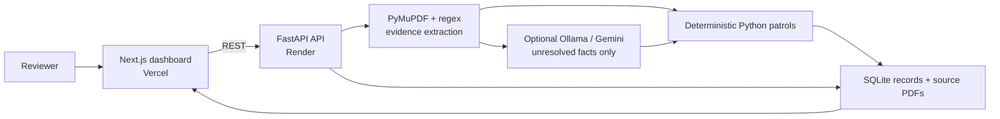

# PO-LICE

**Purchase Order Liability, Intelligence & Compliance Engine**

PO-LICE is a procurement-review prototype for the Kaya AI IIT India
Hackathon 2026. It turns engineering bid PDFs into evidence-backed review
dockets, checks them against deterministic project constraints, and keeps the
final decision with a human reviewer.

[](https://github.com/Aparna-Jha-05/kaya-ai/actions/workflows/ci.yml)
[](https://nextjs.org/)
[](https://fastapi.tiangolo.com/)
[](./openspec/changes/)

## Live prototype

| Resource | Link |
| --- | --- |
| Web application | [po-lice.vercel.app](https://po-lice.vercel.app) |
| Backend readiness | [API status](https://po-lice-backend-staging.onrender.com/api/v1/readiness) |
| Interactive API documentation | [Swagger UI](https://po-lice-backend-staging.onrender.com/docs) |
| Machine-readable API contract | [OpenAPI JSON](https://po-lice-backend-staging.onrender.com/openapi.json) |
| Source repository | [Aparna-Jha-05/kaya-ai](https://github.com/Aparna-Jha-05/kaya-ai) |

These public links were checked on **30 July 2026**. The free-tier backend may
need up to 45 seconds to wake after inactivity.

## The idea

The lowest-price bid is not necessarily the lowest-risk bid. PO-LICE combines
document evidence, engineering limits, sustainability constraints, commercial
terms, delivery risk, and reviewer actions in one explainable workflow.

> **Models extract and explain; deterministic rules and math validate.**

An LLM may propose a value only when it can cite the source document. It
cannot set thresholds or decide `PASS`, `FAIL`, or `FLAG`. Missing evidence
stays missing and requires review.

## What the prototype demonstrates

1. Upload a procurement PDF.
2. Extract facts and their page-level evidence.
3. Run four deterministic patrols:
   Building, Green, Vice Squad, and Traffic Control.
4. Compare bids using compliance status and a bounded five-year cost scenario.
5. Inspect source evidence, approve an RFI draft, and record a reviewer action.
6. Review the activity trail.

The demo currently uses SQLite and filesystem storage. PostgreSQL/Supabase
runtime persistence, authentication/RLS, object storage, durable correlation,
RFI dispatch, and live supplier RAG are planned rather than presented as
working features.

## Documentation

| Document | Use it for |
| --- | --- |
| [Business overview](./BUSINESS.md) | Problem, users, value, differentiators, demo story, and limitations |
| [Technical guide](./TECHNICAL.md) | Architecture, data flow, API, persistence, AI controls, testing, and deployment |
| [Demo runbook](./DEMO_RUNBOOK.md) | Three-minute script, cold-start procedure, acceptance gate, and rollback |
| [ML extraction guide](./backend/ML_EXTRACTION.md) | Ollama/Gemini cascade, privacy controls, evaluation, and fallback |
| [Backend agent guide](./backend/AGENTS.md) | Backend invariants and contributor rules |
| [Active OpenSpec changes](./openspec/changes/) | Accepted intent, design decisions, and remaining work |
| [Original concept PDF](./docs/PO-LICE.pdf) | Aspirational competition concept; not implementation evidence |

## Architecture at a glance



See [TECHNICAL.md](./TECHNICAL.md) for the trust boundary and full request
flow.

## Run locally

### Prerequisites

- Node.js 20+
- Python 3.11+

### Frontend

```bash
npm install
cp .env.example .env.local
npm run dev
```

### Backend

```bash
python3 -m venv .venv
source .venv/bin/activate
pip install -r backend/requirements.txt
cp backend/.env.example backend/.env
PYTHONPATH=backend uvicorn main:app --reload --app-dir backend
```

Set the frontend API URL in `.env.local`:

```bash
NEXT_PUBLIC_PO_LICE_API_URL=http://localhost:8000
```

AI providers are optional and disabled by default. The deterministic upload
and patrol workflow works without downloading a model or adding an API key.
See [backend/ML_EXTRACTION.md](./backend/ML_EXTRACTION.md) before enabling one.

## Verify

```bash
python3 scripts/seed_demo_data.py
PYTHONDONTWRITEBYTECODE=1 PYTHONPATH=backend python3 -m pytest backend/tests
PYTHONDONTWRITEBYTECODE=1 PYTHONPATH=backend python3 scripts/test_pipeline.py
npm run build
python3 scripts/acceptance_gate.py \
  --backend https://po-lice-backend-staging.onrender.com \
  --frontend https://po-lice.vercel.app
```

The current backend suite contains **46 tests**. The last recorded public
acceptance run passed **11/11 checks**; rerun it for release evidence rather
than treating this sentence as a permanent guarantee.

## Team

| Team member | Primary contribution |
| --- | --- |
| **Jb Anmol** | Full-stack integration, extraction, backend orchestration, and release verification |
| **Pratham Amritkar** | RAG and AI systems |
| **Aparna Jha** | Procurement-domain specifications and QA |

Changes should use a short-lived feature branch and a pull request into
`main`. CI should be green before merge; never force-merge through conflicts.

## License

Hackathon prototype. Add an explicit license before reuse outside the team.
