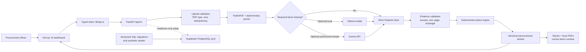

# PO-LICE

> Purchase Order Liability, Intelligence & Compliance Engine
>
> Team TensorTruss · Kaya AI IIT India Hackathon 2026 · Track 3: Procurement

[](https://github.com/Aparna-Jha-05/kaya-ai/actions/workflows/ci.yml)
[](https://nextjs.org/)
[](https://fastapi.tiangolo.com/)
[](openspec/changes)

PO-LICE is an evidence-first procurement review prototype. It accepts vendor
bid PDFs, extracts traceable facts, evaluates them with deterministic rules,
and presents the result as a reviewable procurement docket.

The core rule is non-negotiable:

> **LLMs extract and explain. Deterministic code and stored rules decide.**

An AI model may propose a fact only when it can cite supporting document text.
It cannot set engineering limits, calculate compliance outcomes, or change a
`PASS`, `FAIL`, or `FLAG`. Missing or incompatible evidence becomes `FLAG`.

## Current project status

The frontend and the local backend prototype are integrated and covered by CI.
The PostgreSQL/Supabase schema foundation is tested, but the HTTP API still
uses SQLite and local file storage in explicit demo mode.

| Area | Current state |
| --- | --- |
| Next.js dashboard | Implemented and connected to `lib/api.ts` |
| FastAPI bid workflow | Upload, list, detail, source, delete, review, simulation, RFI, constraints, suppliers, activity, and audit routes |
| PDF extraction | PyMuPDF text extraction, conservative parsing, normalized units, excerpts, page geometry, and evidence rectangles |
| Optional AI extraction | Ollama local adapter and Gemini remote adapter; disabled by default |
| Compliance decisions | Four deterministic Python patrols |
| Local persistence | SQLite plus local source-PDF storage |
| Provenance and retries | SHA-256 provenance and project-scoped upload idempotency |
| Human decisions | Optimistic concurrency, audited state changes, and separate RFI approval |
| Reassessment | Constraint changes create new assessment versions without overwriting officer decisions |
| PostgreSQL foundation | Ordered migrations, checksum tracking, pgvector schema, synthetic seeding, and integration tests |
| Production Supabase runtime | Not connected to HTTP CRUD yet |
| Authentication and RLS | Planned, not implemented |
| OpenAI and Anthropic extraction | Specified, not implemented |
| Live vendor RAG and verified supplier geography | Planned, not implemented |

Do not present planned functionality as deployed functionality. In particular,
the current prototype does not have production Supabase CRUD, Supabase Auth,
live pgvector retrieval, full CAD/BIM interpretation, immutable production
audit storage, or automatic email dispatch.

## Architecture



### Request flow

1. The frontend sends a PDF and an `Idempotency-Key` to FastAPI.
2. FastAPI validates the filename, declared media type, PDF magic bytes, and
   15 MB size limit.
3. The backend computes SHA-256 provenance and extracts document text.
4. Deterministic parsing runs first. Optional Ollama and Gemini extraction can
   fill only unresolved fields.
5. Every accepted candidate must retain its source excerpt and canonical unit.
   Located evidence also stores page dimensions, rotation, coordinate system,
   and `[x0, y0, x1, y1]`.
6. The deterministic patrol engine evaluates the accepted facts against the
   current versioned site constraints.
7. SQLite stores the source reference, extraction report, scorecard, assessment
   history, officer decision, RFI state, and activity events.
8. The frontend renders the work queue, evidence, patrol results, TCO scenario,
   review actions, and audit activity.

## The four patrols

| Patrol | Implemented behavior | Production work still required |
| --- | --- | --- |
| Building Patrol | Compares power, equipment width, and warranty evidence with the referenced constraint version | Domain confirmation of door-clearance semantics |
| Green Patrol | Checks extracted carbon evidence against the configured cap and flags missing data | Approved carbon functional unit and dimensionally safe comparison |
| Vice Squad | Uses deterministic certificate, clause, and integrity signals | Project-scoped pgvector retrieval and an approved bounded risk formula |
| Traffic Control | Calculates deterministic lead-time exposure and bounded scenario values | Approved currency, horizon, penalty, and carbon-tax units |

The patrol engine returns:

- `PASS` when required evidence is present and within the configured rule.
- `FAIL` when supported evidence deterministically breaches a rule.
- `FLAG` when evidence is missing, unsupported, incompatible, disputed, or
  requires a human decision.

## Technology map

| Technology | Purpose |
| --- | --- |
| Next.js 14, React 18, TypeScript | Dashboard, bid work queue, review workspace, audit view |
| Tailwind CSS, Framer Motion, Recharts | Styling, interaction, and charts |
| FastAPI, Pydantic v2 | HTTP API and strict request/response contracts |
| PyMuPDF | PDF text, metadata, page geometry, and evidence rectangles |
| Python deterministic rules | Compliance patrols and scenario calculations |
| SQLite | Current local/demo bid, assessment, RFI, and activity persistence |
| Local filesystem | Current source-PDF storage |
| Ollama | Optional local structured extraction |
| Gemini API | Optional authorized remote structured extraction |
| asyncpg, PostgreSQL, pgvector | Tested database foundation for the next persistence and RAG phase |
| OpenSpec | Intended behavior, architecture decisions, and implementation tasks |
| GitHub Actions | Frontend, backend, database, OpenAPI, extraction, and OpenSpec checks |
| Vercel | Frontend hosting |
| Render | Backend staging definition in `render.yaml` |
| Supabase | Planned PostgreSQL/Auth/RLS platform; runtime CRUD is not wired yet |

## Repository layout

```text
app/                         Next.js routes: dashboard, bids, bid detail, audit
components/                  Dashboard, evidence, review, RFI, and UI components
lib/api.ts                   Canonical frontend-to-backend client
lib/mockData.ts              Remaining prototype fixtures; not backend truth
lib/patrols.ts               Legacy/demo client rules; backend Python is authoritative

backend/main.py              FastAPI boundary and /api/v1 routes
backend/app/models/          Strict Pydantic API and evidence models
backend/app/services/        Extraction, model cascade, patrols, RFI, persistence
backend/app/db/supabase.py   Bounded asyncpg pool and readiness helpers
backend/tests/               Assertion-based backend and API contract tests
backend/openapi.json         Committed frontend compatibility baseline

scripts/migrations/          Ordered PostgreSQL/pgvector migrations
scripts/migrate_postgres.py  Checksum-verified migration runner
scripts/seed_supabase.py     Idempotent synthetic PostgreSQL seeder
scripts/seed_demo_data.py    Synthetic local PDF generator
scripts/evaluate_extraction.py
                             Labeled extraction evaluation
scripts/test_pipeline.py     Assertion-based demo pipeline smoke check

openspec/changes/            Active backend and AI-provider specifications
.github/workflows/ci.yml     Cross-stack pull-request and main-branch CI
render.yaml                  Backend staging service definition
AGENTS.md                    Repository-wide engineering guardrails
backend/AGENTS.md            Backend-specific contracts and safety rules
```

## Local development

### Prerequisites

- Node.js 20
- Python 3.11
- npm
- Optional: Ollama for local model extraction
- Optional: a PostgreSQL database with pgvector for migration testing

### 1. Install dependencies

```bash
npm ci

python3 -m venv .venv
source .venv/bin/activate
python -m pip install --upgrade pip
python -m pip install -r backend/requirements-test.txt
```

### 2. Configure local environment

```bash
cp .env.example .env.local
```

Next.js loads `.env.local` automatically. The Python backend does not load it
automatically, so export it into the shell before starting FastAPI:

```bash
set -a
source .env.local
set +a
```

For the frontend, add:

```dotenv
NEXT_PUBLIC_PO_LICE_API_URL=http://localhost:8000
```

Never prefix a backend secret with `NEXT_PUBLIC_`. Do not commit `.env.local`.

### 3. Start the backend

```bash
PYTHONPATH=backend uvicorn main:app --reload --port 8000
```

Useful URLs:

- API root: <http://localhost:8000/>
- Readiness: <http://localhost:8000/api/v1/readiness>
- OpenAPI UI: <http://localhost:8000/docs>
- OpenAPI JSON: <http://localhost:8000/openapi.json>

### 4. Start the frontend

In another terminal:

```bash
npm run dev
```

Open <http://localhost:3000>.

### 5. Create synthetic demo PDFs

```bash
python scripts/seed_demo_data.py
```

The generated fixtures are synthetic and safe for local testing. Never add
real vendor documents, credentials, bid contents, or personal data to Git.

## Optional AI extraction

Deterministic extraction always runs first. Models receive only unresolved
fields and cannot return compliance verdicts.

### Ollama: local and free

Ollama downloads the selected model onto the machine running the backend. The
repository does not bundle model weights.

```dotenv
OLLAMA_ENABLED=true
OLLAMA_BASE_URL=http://localhost:11434
OLLAMA_MODEL=<evaluated-model-tag>
```

Install and pull the exact model separately with Ollama. Mistral 7B Instruct
is currently a benchmark candidate, not a validated winner. Keep
`OLLAMA_ENABLED=false` when the runtime cannot host a local model.

### Gemini: optional remote fallback

```dotenv
REMOTE_EXTRACTION_ENABLED=true
REMOTE_EXTRACTION_PROJECTS=PRJ-AMBER-01
GEMINI_MODEL=<evaluated-model-name>
GEMINI_API_KEY=<server-side-key>
```

Remote extraction is allowed only when the feature is enabled, the project is
allow-listed, and both model and key are configured. The backend sends reduced
evidence context and records the disclosure metadata. OpenAI and Anthropic are
not implemented yet; their active OpenSpec requires adapter tests and measured
evaluation before either enters automatic routing.

## Verification

Run the same core checks used by CI:

```bash
python scripts/seed_demo_data.py
PYTHONDONTWRITEBYTECODE=1 PYTHONPATH=backend \
  python -m unittest discover -s backend/tests -v
PYTHONPATH=backend python scripts/evaluate_extraction.py --assert-baseline
PYTHONPATH=backend python scripts/test_pipeline.py
python scripts/export_openapi.py --check
npm run build

openspec validate robust-supabase-backend --strict
openspec validate multi-provider-pdf-extraction --strict
openspec validate configurable-ai-provider-routing --strict
```

CI additionally starts PostgreSQL 16 with pgvector and runs:

```bash
TEST_DATABASE_URL=postgresql://... python scripts/test_postgres_foundation.py
```

Static validation, unit tests, database integration, frontend build, and live
staging verification are separate kinds of evidence. A passing local build
does not prove that a remote provider or production deployment works.

## PostgreSQL and Supabase foundation

The repository includes ordered migrations and a synthetic seeder:

```bash
export SUPABASE_DATABASE_URL='postgresql://...'
python scripts/migrate_postgres.py
python scripts/seed_supabase.py
```

This creates and verifies the PostgreSQL schema only. Until the PostgreSQL
repository, authentication, and RLS work is completed, FastAPI CRUD remains on
SQLite with `DEMO_MODE=true`.

## Deployment shape

```text
Browser
  └── Vercel: Next.js frontend
        └── NEXT_PUBLIC_PO_LICE_API_URL
              └── Render: FastAPI backend staging
                    ├── current demo: SQLite + local files
                    └── target: Supabase PostgreSQL/Auth/RLS/Object Storage
```

`render.yaml` deploys the backend from `main` after checks pass. Before any
public deployment, configure allowed origins and backend secrets in the
hosting dashboard. Never place provider keys or database credentials in
frontend variables or committed files.

## API surface

The current `/api/v1` API includes:

- Bid upload, list, detail, source download, and delete
- Reviewer activity and officer decision updates
- Deterministic TCO scenario simulation
- RFI draft creation, listing, and separate human approval
- Current site constraints and versioned constraint updates
- Supplier prototype data
- Activity and audit views
- Readiness reporting

The committed contract is `backend/openapi.json`. Regenerate it after API model
or route changes:

```bash
python scripts/export_openapi.py
```

CI fails when the snapshot is stale.

## Team and ownership

| Team member | Role | Current ownership and contribution |
| --- | --- | --- |
| **Aparna Jha** | Team lead, domain specification, QA | Procurement requirements, domain scenarios, acceptance review, and validation of engineering/carbon/risk/TCO semantics |
| **Jb Anmol** | Full-stack and repository orchestration | Frontend/backend integration, extraction contracts, API hardening, CI, PostgreSQL foundation, upload provenance, evidence regions, and reassessment history |
| **Pratham Amritkar** | RAG and AI systems | Local/remote model evaluation, embedding and retrieval design, and future vendor-history RAG integration |

Important backend milestones already merged:

- Hardened the prototype API, RFI workflow, constraints, tests, and CI.
- Added verified PostgreSQL migrations, pgvector schema checks, and synthetic
  seeding.
- Added immutable upload provenance, project-scoped idempotency, neutral PDF
  integrity signals, and page-coordinate evidence.
- Added versioned reassessment history that preserves prior patrol results and
  human officer decisions.

Ownership indicates the primary point of contact, not an exclusive boundary.
Cross-stack API changes should be reviewed by both frontend and backend owners;
domain formulas require domain/QA approval.

## Collaboration workflow

1. Keep `main` deployable and protected.
2. Create one focused feature branch per change.
3. Update the relevant OpenSpec artifacts before or with implementation.
4. Open a pull request to `main`; do not force-merge conflicts.
5. Let CI validate the frontend, backend, OpenAPI snapshot, PostgreSQL
   foundation, extraction baseline, and all active OpenSpecs.
6. Resolve conflicts in the feature branch by updating it from `main`, rerun
   checks, and push the resolution.
7. Merge only after review and green checks.

For conflicts, the feature author should not guess across another owner's
files. Open the PR, describe the conflict, and resolve it with the affected
owner.

## Remaining roadmap

The next production-critical work is:

1. Review the final `/api/v1` pagination, error, and lifecycle contract.
2. Obtain domain approval for carbon units, Vice Squad scoring, and TCO² units.
3. Connect FastAPI CRUD to Supabase PostgreSQL.
4. Add authentication, project isolation, RLS, and object storage.
5. Complete paginated bid, supplier, and append-only audit APIs.
6. Finish frontend evidence, dimension, RFI, supplier, and audit integration.
7. Run labeled Ollama/Gemini evaluations; add OpenAI or Anthropic only when
   measured results justify the extra provider.
8. Deploy backend staging, run health and end-to-end checks, then promote.

The detailed source of truth is in `openspec/changes/`. Executed code and
assertion-based tests describe current behavior; accepted OpenSpec artifacts
describe intended behavior.
