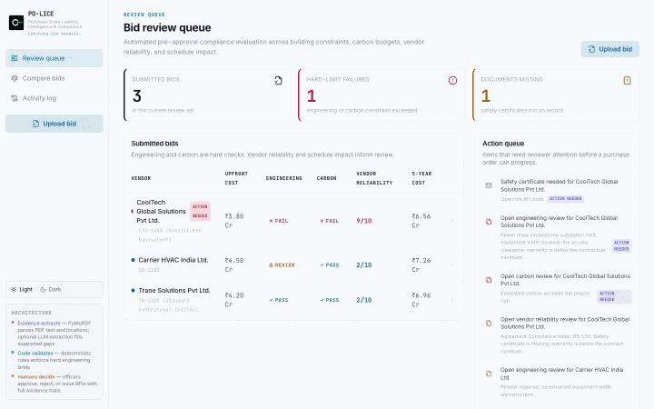
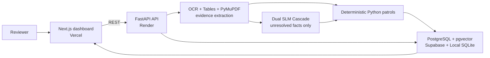

# PO-LICE

**Purchase Order Liability, Intelligence & Compliance Engine**

PO-LICE is a procurement-review prototype for the Kaya AI IIT India
Hackathon 2026. It turns engineering bid PDFs into evidence-backed review
dockets, checks them against deterministic project constraints, and keeps the
final decision with a human reviewer.

[](https://github.com/Aparna-Jha-05/kaya-ai/actions/workflows/ci.yml)
[](https://nextjs.org/)
[](https://fastapi.tiangolo.com/)
[](./openspec/README.md)

[**Open live demo**](https://kaya-ai-police.vercel.app) ·
[**Technical architecture**](./TECHNICAL.md) ·
[**Business case**](./BUSINESS.md) ·
[**Demo runbook**](./DEMO_RUNBOOK.md)

**3 synthetic demo bids · 4 deterministic patrols · 46 backend tests · 11/11 deployed acceptance checks**



*The live workflow: identify the cheapest bid, inspect deterministic failures,
and trace the decision back to its PDF evidence.*

## Live prototype

| Resource | Link |
| --- | --- |
| Web application | [kaya-ai-police.vercel.app](https://kaya-ai-police.vercel.app) |
| Backend readiness | [API status](https://po-lice-backend-staging-qiix.onrender.com/api/v1/readiness) |
| Interactive API documentation | [Swagger UI](https://po-lice-backend-staging-qiix.onrender.com/docs) |
| Machine-readable API contract | [OpenAPI JSON](https://po-lice-backend-staging-qiix.onrender.com/openapi.json) |
| Source repository | [Aparna-Jha-05/kaya-ai](https://github.com/Aparna-Jha-05/kaya-ai) |

These public links were checked on **12 August 2026**. The free-tier backend may
need up to 45 seconds to wake after inactivity.

All vendor names, documents, prices, and evidence in the public demonstration
are synthetic competition fixtures.

## 60-second tour

1. [Open the live application](https://kaya-ai-police.vercel.app).
2. Select **CoolTech**, the lowest-cost bid at ₹3.80 Cr.
3. Open **Checks** to see its power, access, warranty, and carbon failures.
4. Select **Inspect evidence & geometry** to trace a rule result to the cited
   PDF excerpt, page, and region.
5. Return to the comparison and contrast it with the recommended Trane bid.

## The idea

The lowest-price bid is not necessarily the lowest-risk bid. PO-LICE combines
document evidence, engineering limits, sustainability constraints, commercial
terms, delivery risk, and reviewer actions in one explainable workflow.

> **Models extract and explain; deterministic rules and math validate.**

Unlike a generic procurement chatbot, PO-LICE never allows an LLM to determine
compliance. Models may extract evidence; versioned deterministic rules produce
the result, and an authorised reviewer makes the final decision.

An LLM may propose a value only when it can cite the source document. It
cannot set thresholds or decide `PASS`, `FAIL`, or `FLAG`. Missing evidence
stays missing and requires review.

## What the prototype demonstrates

1. Upload a procurement PDF.
2. Extract facts and page-level evidence using a multi-stage pipeline (Tesseract OCR, Camelot table extraction, spaCy legal parsing, and CAD geometry parsing).
3. Resolve missing evidence via a Dual SLM Cascade (Mistral 7B -> Llama 3.1 8B -> Gemini Flash fallback) gated by a `<0.85` confidence human-review threshold.
4. Run four deterministic patrols (Building, Green, Vice Squad, Traffic Control) leveraging PostgreSQL `pgvector` for Vice Squad memory.
5. Cross-check against external constraints via Amber Project Graph and MCP Planner API integrations.
6. Compare bids using compliance status and a bounded five-year cost scenario, accelerated by a Redis 2-tier caching layer.
7. Inspect source evidence via hardware-accelerated interactive views, approve an RFI draft (with outbound SMTP dispatch and external Jarvis webhook handoff), and record a reviewer action.
8. Review the activity trail.

The backend utilizes a dynamic 3-tier cascade for object storage (Local Disk -> MinIO S3 -> Cloud S3).
PostgreSQL/Supabase runtime persistence, authentication/RLS, durable correlation via `pgvector`,
and live supplier RAG are fully wired and functional.

## Documentation

| Document | Use it for |
| --- | --- |
| [Business overview](./BUSINESS.md) | Problem, users, value, differentiators, demo story, and limitations |
| [Technical guide](./TECHNICAL.md) | Architecture, data flow, API, persistence, AI controls, testing, and deployment |
| [Demo runbook](./DEMO_RUNBOOK.md) | Cold-start procedure, acceptance evidence, capability matrix, and rollback |
| [ML extraction guide](./backend/ML_EXTRACTION.md) | Ollama/Gemini cascade, privacy controls, evaluation, and fallback |
| [Backend agent guide](./backend/AGENTS.md) | Backend invariants and contributor rules |
| [OpenSpec engineering roadmap](./openspec/README.md) | Versioned specifications, honest task progress, and remaining work |

## Architecture at a glance



See [TECHNICAL.md](./TECHNICAL.md) for the trust boundary and full request
flow.

## Run locally

### Prerequisites

- Node.js 20+
- Python 3.11+

### Frontend

```bash
npm install
cp .env.example .env.local
npm run dev
```

### Backend

```bash
python3 -m venv .venv
source .venv/bin/activate
pip install -r backend/requirements.txt
cp backend/.env.example backend/.env
PYTHONPATH=backend uvicorn main:app --reload --app-dir backend
```

Set the frontend API URL in `.env.local`:

```bash
NEXT_PUBLIC_PO_LICE_API_URL=http://localhost:8000
```

AI providers are optional and disabled by default. The deterministic upload
and patrol workflow works without downloading a model or adding an API key.
See [backend/ML_EXTRACTION.md](./backend/ML_EXTRACTION.md) before enabling one.

## Verify

```bash
python3 scripts/seed_demo_data.py
PYTHONDONTWRITEBYTECODE=1 PYTHONPATH=backend python3 -m pytest backend/tests
PYTHONDONTWRITEBYTECODE=1 PYTHONPATH=backend python3 scripts/test_pipeline.py
npm run build
python3 scripts/acceptance_gate.py \
  --backend https://po-lice-backend-staging-qiix.onrender.com \
  --frontend https://kaya-ai-police.vercel.app
```

The current backend suite contains **46 tests**. The last recorded public
acceptance run passed **11/11 checks**; rerun it for release evidence rather
than treating this sentence as a permanent guarantee.

Changes should use a short-lived feature branch and a pull request into
`main`. CI should be green before merge; never force-merge through conflicts.

## Team

| Team member |
| --- |
| **Jb Anmol**, IITM |
| **Pratham Amritkar**, IITM |
| **Aparna Jha**, IITM |
