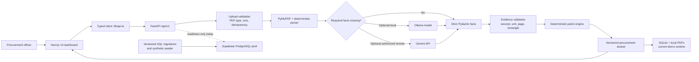

# PO-LICE

> Purchase Order Liability, Intelligence & Compliance Engine
>
> Team TensorTruss · Kaya AI IIT India Hackathon 2026 · Track 3: Procurement

[](https://github.com/Aparna-Jha-05/kaya-ai/actions/workflows/ci.yml)
[](https://nextjs.org/)
[](https://fastapi.tiangolo.com/)
[](openspec/changes)

PO-LICE is an evidence-first procurement review prototype. It accepts vendor
bid PDFs, extracts traceable facts, evaluates them with deterministic rules,
and presents the result as a reviewable procurement docket.

The core architecture rule is non-negotiable:

> **LLMs extract and explain. Deterministic code and stored rules decide.**

An AI model may propose a candidate fact only when it can cite supporting document text.
It cannot set engineering limits, calculate compliance outcomes, or change a
`PASS`, `FAIL`, `FLAG`, or officer decision. Missing or incompatible evidence becomes `FLAG`.

---

## 🏆 Competition Demo Readiness

PO-LICE includes a complete, deterministic, model-independent competition demo workflow covered by an assertion-based test suite and deployed acceptance gate.

### Quick Start & Verification
```bash
# 1. Install dependencies
npm ci
pip install -r backend/requirements.txt

# 2. Seed synthetic demo fixtures (idempotent)
PYTHONPATH=backend python3 scripts/seed_demo_data.py

# 3. Start local backend server (Terminal 1)
PYTHONPATH=backend uvicorn main:app --reload --port 8000

# 4. Start local Next.js frontend (Terminal 2)
npm run dev

# 5. Run the 42 assertion-based unit tests
PYTHONDONTWRITEBYTECODE=1 PYTHONPATH=backend:. python3 -m unittest discover -s backend/tests -v

# 6. Run the competition deployed acceptance gate
python3 scripts/acceptance_gate.py --backend http://localhost:8000 --frontend http://localhost:3000
```

For the competition operator runbook, timed 3-minute demo script, visual checklist, and rollback guide, see [DEMO_RUNBOOK.md](DEMO_RUNBOOK.md).

> **Note on Demo Data**: All bid documents, vendor names, and company details in the demo dataset are **100% synthetic**. No real vendor documents or private data are used.

---

## Current project status

The frontend and local backend prototype are fully integrated and covered by CI.
The PostgreSQL/Supabase schema foundation is tested, but the HTTP API uses
SQLite and local file storage in explicit demo mode.

| Area | Current state |
| --- | --- |
| Next.js dashboard | Implemented and connected to `lib/api.ts` (Review Queue, Portfolio, Bid Workspace, Audit) |
| FastAPI bid workflow | Upload, list, detail, source, delete, review actions, simulation, RFI, constraints, suppliers, activity, and audit routes |
| PDF extraction | PyMuPDF text extraction, unit normalization, source excerpts, page geometry, and evidence bounding boxes |
| Optional AI extraction | Ollama local adapter and Gemini remote adapter; disabled by default for guaranteed deterministic operation |
| Compliance decisions | Four deterministic Python patrols (Building Patrol, Green Patrol, Vice Squad, Traffic Control) |
| Local persistence | SQLite + local source-PDF storage with WAL mode, foreign keys, and optimistic concurrency |
| Provenance and retries | SHA-256 provenance and project-scoped upload idempotency |
| Human decisions | Optimistic concurrency (`expected_version`), audited state changes, and separate RFI approval |
| Reassessment | Constraint changes create new assessment versions without overwriting officer decisions |
| PostgreSQL foundation | Ordered migrations, checksum tracking, pgvector schema, synthetic seeding, and integration tests |
| Production Supabase runtime | Schema verified; HTTP CRUD connection planned |
| Authentication and RLS | Planned, not implemented |
| OpenAI and Anthropic extraction | Specified, not implemented |
| Live vendor RAG and verified supplier geography | Planned, not implemented |

Do not present planned functionality as deployed functionality. In particular,
the current prototype does not have production Supabase CRUD, Supabase Auth,
live pgvector retrieval, full CAD/BIM model parsing, or automatic email dispatch.

---

## Architecture



### Request flow

1. **Ingestion**: Uploaded PDF bytes generate a SHA-256 fingerprint and checked idempotency key. Source provenance is saved immutably.
2. **Extraction**: PyMuPDF extracts text, normalizes units (kW, m, kgCO2e, weeks), and captures page bounding box geometry.
3. **Optional Model Cascade**: Missing fields are requested from local Ollama or Gemini. Incompatible candidate values are rejected.
4. **Patrol Engine**: Strict Pydantic facts run through 4 deterministic Python patrols:
   - **Building Patrol**: Substation power draw limit (1,200 kW), equipment door clearance (1.9 m).
   - **Green Patrol**: Embodied carbon cap (450 kgCO2e/ton).
   - **Vice Squad**: Vendor integrity signals and safety certificate check (OSHA 300).
   - **Traffic Control**: Delivery schedule exposure and float penalty.
5. **Scorecard & Docket**: Decision recommendations (`RECOMMENDED`, `REVIEW_REQUIRED`, `REJECT`) are stored with versioned assessment history.
6. **Human Review & Action**: Reviewers inspect cited evidence, review RFI drafts, adjust TCO scenario sliders, and record audited decisions with optimistic concurrency.

---

## Repository routing

```text
backend/                       FastAPI boundary, SQLite repository, patrol engine
backend/AGENTS.md              Backend developer and agent guardrails
app/, components/, lib/        Next.js 14 frontend dashboard & typed API client
DEMO_RUNBOOK.md                Competition operator runbook, timed demo script, & visual checklist
openspec/changes/              Proposed behavior and OpenSpec task definitions
scripts/seed_demo_data.py      Idempotent synthetic demo dataset generator
scripts/acceptance_gate.py     Acceptance gate script for pre-demo validation
scripts/test_pipeline.py       Backend pipeline smoke check runner
AGENTS.md                      Repository-wide engineering guardrails
```

---

## Local development

### Prerequisites

- Node.js 20
- Python 3.11
- npm
- Optional: Ollama for local model extraction
- Optional: a PostgreSQL database with pgvector for migration testing

### 1. Install dependencies

```bash
npm ci

python3 -m venv .venv
source .venv/bin/activate
python -m pip install --upgrade pip
python -m pip install -r backend/requirements-test.txt
```

### 2. Configure local environment

```bash
cp .env.example .env.local
```

Next.js loads `.env.local` automatically. Export it before starting FastAPI:

```bash
set -a
source .env.local
set +a
```

For the frontend, add:

```dotenv
NEXT_PUBLIC_PO_LICE_API_URL=http://localhost:8000
```

Never prefix a backend secret with `NEXT_PUBLIC_`. Do not commit `.env.local`.

### 3. Start the backend

```bash
PYTHONPATH=backend uvicorn main:app --reload --port 8000
```

Useful URLs:

- API root: <http://localhost:8000/>
- Readiness: <http://localhost:8000/api/v1/readiness>
- OpenAPI UI: <http://localhost:8000/docs>
- OpenAPI JSON: <http://localhost:8000/openapi.json>

### 4. Start the frontend

In another terminal:

```bash
npm run dev
```

Open <http://localhost:3000>.

### 5. Create synthetic demo PDFs

```bash
PYTHONPATH=backend python3 scripts/seed_demo_data.py
```

The generated fixtures are synthetic and safe for local testing. Never add
real vendor documents, credentials, bid contents, or personal data to Git.

---

## Optional AI extraction

Deterministic extraction always runs first. Models receive only unresolved
fields and cannot return compliance verdicts.

### Ollama: local and free

```dotenv
OLLAMA_ENABLED=true
OLLAMA_BASE_URL=http://localhost:11434
OLLAMA_MODEL=<evaluated-model-tag>
```

Keep `OLLAMA_ENABLED=false` when the runtime cannot host a local model.

### Gemini: optional remote fallback

```dotenv
REMOTE_EXTRACTION_ENABLED=true
REMOTE_EXTRACTION_PROJECTS=PRJ-AMBER-01
GEMINI_MODEL=<evaluated-model-name>
GEMINI_API_KEY=<server-side-key>
```

Remote extraction is allowed only when enabled, allowed by project, and configured. The backend sends reduced context and records disclosure metadata. OpenAI and Anthropic are not implemented yet.

---

## Verification

Run the core verification suite:

```bash
# Seed synthetic fixtures
PYTHONPATH=backend python3 scripts/seed_demo_data.py

# Run all 42 assertion-based unit tests
PYTHONDONTWRITEBYTECODE=1 PYTHONPATH=backend:. \
  python3 -m unittest discover -s backend/tests -v

# Run extraction evaluation baseline & pipeline smoke check
PYTHONPATH=backend python3 scripts/evaluate_extraction.py --assert-baseline
PYTHONPATH=backend python3 scripts/test_pipeline.py

# Export and verify OpenAPI snapshot
python3 scripts/export_openapi.py --check

# Run Next.js production build check
npm run build

# Validate OpenSpecs strictly
npx openspec validate competition-demo-readiness --strict
npx openspec validate robust-supabase-backend --strict
npx openspec validate multi-provider-pdf-extraction --strict

# Run deployed acceptance gate (10/10 checks)
python3 scripts/acceptance_gate.py --backend http://localhost:8000 --frontend http://localhost:3000
```

---

## PostgreSQL and Supabase foundation

The repository includes ordered migrations and a synthetic seeder:

```bash
export SUPABASE_DATABASE_URL='postgresql://...'
python3 scripts/migrate_postgres.py
python3 scripts/seed_supabase.py
```

This creates and verifies the PostgreSQL schema. FastAPI CRUD uses SQLite with `DEMO_MODE=true`.

---

## API surface

The current `/api/v1` API includes:

- Bid upload, list, detail, source download, and delete
- Reviewer activity and officer decision updates
- Deterministic TCO scenario simulation
- RFI draft creation, listing, and separate human approval
- Current site constraints and versioned constraint updates
- Supplier prototype data
- Activity and audit views
- Readiness reporting

The committed contract is `backend/openapi.json`. Regenerate it after API schema or route changes:

```bash
python3 scripts/export_openapi.py
```

---

## Team and ownership

| Team member | Role | Current ownership and contribution |
| --- | --- | --- |
| **Aparna Jha** | Team lead, domain specification, QA | Procurement requirements, domain scenarios, acceptance review, and validation of engineering/carbon/risk/TCO semantics |
| **Jb Anmol** | Full-stack and repository orchestration | Frontend/backend integration, extraction contracts, API hardening, CI, PostgreSQL foundation, upload provenance, evidence regions, and reassessment history |
| **Pratham Amritkar** | RAG and AI systems | Local/remote model evaluation, embedding and retrieval design, and future vendor-history RAG integration |

---

## Collaboration workflow

1. Keep `main` deployable and protected.
2. Create one focused feature branch per change.
3. Update the relevant OpenSpec artifacts before or with implementation.
4. Open a pull request to `main`; do not force-merge conflicts.
5. Let CI validate the frontend, backend, OpenAPI snapshot, PostgreSQL foundation, extraction baseline, and all active OpenSpecs.
6. Merge only after review and green checks.
