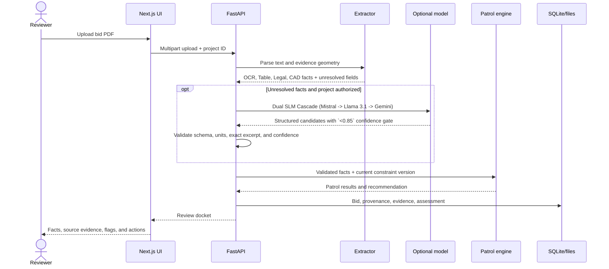

# PO-LICE Technical Guide

This document describes the current executable prototype. When it conflicts
with code or assertion-based tests, the code and tests win.

## Core safety rule

> **LLM/VLM extracts and explains; deterministic rules and math validate.**

- Model output is an evidence-bound candidate, never a compliance verdict.
- Missing or uncertain evidence becomes `FLAG`, not an inferred value.
- Patrol results are reproducible from stored facts, units, rule inputs,
  constraint version, and engine behavior.
- Reviewer approval, correction, rejection, and RFI approval are separate
  audited actions.

## Runtime architecture

| Layer | Technology | Responsibility |
| --- | --- | --- |
| Web client | Next.js 14, React, TypeScript, Tailwind CSS | Review queue, bid comparison, hardware-accelerated evidence inspection, upload, simulation, RFI approval, and activity UI |
| API | FastAPI, Pydantic | Validates requests and exposes the implemented workflow |
| Document extraction | OCR (Tesseract/EasyOCR), Tables (pdfplumber/Camelot), spaCy Legal Parsing, CAD Intelligence | Multi-stage parsing for text, tables, legal clauses, and vector geometry (`WIDTH_M`, `LENGTH_M`) |
| SLM Model extraction | Dual Cascade (Mistral 7B -> Llama 3.1 8B -> Gemini Flash) | Proposes unresolved facts gated by a `<0.85` confidence human-review threshold |
| Decision engine | Deterministic Python patrol service | Applies versioned thresholds and calculates `PASS`, `FAIL`, `FLAG`, recommendation, and TCO scenario output |
| Persistence | PostgreSQL (`pgvector`), Supabase Auth/RLS, SQLite & Multi-Tier Cascade | HNSW 1536-dim vector memory, JWT auth, records, and 3-tier PDF object storage |
| Caching | Redis 2-Tier Cache | L1 In-Memory TTL -> L2 Redis Cluster for performance |
| External Integration | Amber Graph, MCP Planner, Outbound SMTP & Jarvis Webhooks | BIM/CPM schedule integration, RFI dispatch, and external agent handoffs |
| Demo deployment | Vercel and Render | Public frontend and backend prototype |

PostgreSQL/pgvector (HNSW 1536-dim vector search) and Supabase Auth (JWT) / RLS are fully wired and functional.
The `/api/v1/readiness` endpoint actively probes Supabase, which powers runtime CRUD, authentication, and vector retrieval.

## Request flow



## Frontend

The app routes live under `app/`, reusable UI under `components/`, and the
canonical HTTP client under [`lib/api.ts`](./lib/api.ts). The deployed
frontend reads `NEXT_PUBLIC_PO_LICE_API_URL`; provider secrets never belong in
the browser.

Main reviewer flows:

- review queue and summary metrics;
- bid portfolio comparison;
- bid detail, checks, evidence, and source data;
- PDF upload;
- bounded cost simulation;
- reviewer decision recording;
- RFI draft review and approval;
- activity log and CSV export.

## Backend

The FastAPI boundary is [`backend/main.py`](./backend/main.py). Pydantic
contracts are under [`backend/app/models`](./backend/app/models), with the
main services under [`backend/app/services`](./backend/app/services).

The implemented API covers:

- liveness and readiness;
- bid upload, list, detail, source PDF, and delete;
- simulation;
- reviewer decisions with optimistic version checks;
- RFI generation, approval, and live SMTP dispatch with exponential backoff;
- external Jarvis webhook delegation via HMAC-SHA256 signatures;
- site-constraint version updates and reassessment;
- Amber Project Graph (BIM structural/electrical constraints) and MCP Planner (CPM float analysis) connections;
- Redis L1/L2 caching;
- activity retrieval/export used by the dashboard.

Use the deployed [Swagger UI](https://po-lice-backend-staging.onrender.com/docs)
or [OpenAPI JSON](https://po-lice-backend-staging.onrender.com/openapi.json)
as the exact route-level contract.

## Extraction cascade

The extraction path leverages a deep multi-stage pipeline:

1. **Scanned OCR & Tables**: Tesseract (300DPI) -> EasyOCR -> PyMuPDF Block fallback handles text, and pdfplumber -> Camelot-py -> Matrix fallback handles tables.
2. **Legal & CAD**: spaCy Syntactic Matcher segments legal clauses, and CAD Intelligence parses spatial vector callouts (`WIDTH_M`, `LENGTH_M`). PyMuPDF runs deep metadata anomaly inspection (surfacing flags like `MODIFICATION_BEFORE_CREATION`).
3. **Dual SLM Cascade**: For unresolved fields, Mistral 7B -> Llama 3.1 8B -> Remote Gemini Flash executes.
4. **Confidence Scoring**: Candidates are scored; anything `<0.85` enters a human review gate.
5. Pydantic validates provider structure, units, field allow-list, and exact source support.
6. Conflicts or missing facts remain for human review.

## Deterministic patrols

[`PatrolEngineService`](./backend/app/services/patrols.py) runs four checks:

| Patrol | Current purpose |
| --- | --- |
| Building Patrol | Power draw, access width, and contractual warranty limits |
| Green Patrol | Embodied-carbon cap and suspicious low-price benchmark |
| Vice Squad | Safety certificate, contract clauses, and integrity correlations |
| Traffic Control | Delivery exposure, lifecycle change, and bounded TCO scenario |

Any hard threshold breach produces `FAIL`. Missing required evidence produces
`FLAG`. The overall recommendation is `REJECT` when a patrol fails,
`REVIEW_REQUIRED` when review flags remain, otherwise `RECOMMENDED`.

Constraints are versioned in SQLite and loaded by the Python rules engine.
Changing a constraint creates a new assessment while preserving the prior
human decision.

## Persistence and audit

Storage utilizes a dynamic Stage S1 Multi-Tier Blob Storage Cascade:

```text
$PO_LICE_DATA_DIR/
├── po_lice.sqlite3
└── uploads/
    └── {bid_id}.pdf
```

The `StorageService` replicates blobs seamlessly from Local Disk to MinIO S3, and finally to Cloud Supabase S3 depending on environment variables.
The repository layer provides project-scoped upload idempotency, immutable
source provenance, optimistic decision versions, constraint versions,
assessment history, and separate RFI draft/approval states.

**PostgreSQL, pgvector, and Supabase Auth**: The system is fully wired to use Supabase PostgreSQL with `pgvector` for HNSW 1536-dim vector similarity search (Vendor RAG Memory) and Supabase Auth with RLS (`00003_rls_policies.sql`) for secure JWT Bearer token access.

## Configuration

Frontend:

```bash
NEXT_PUBLIC_PO_LICE_API_URL=http://localhost:8000
```

Backend deterministic demo:

```bash
DEMO_MODE=true
PO_LICE_PROJECT_ID=PRJ-POLICE-01
PO_LICE_ALLOWED_ORIGINS=http://localhost:3000
OLLAMA_ENABLED=false
REMOTE_EXTRACTION_ENABLED=false
```

Keep Gemini/Ollama settings and all secrets server-side. Never use a
`NEXT_PUBLIC_*` variable for an API key.

## Verification

Run the smallest relevant check first, then the full release sequence:

```bash
python3 scripts/seed_demo_data.py
PYTHONDONTWRITEBYTECODE=1 PYTHONPATH=backend python3 -m pytest backend/tests
PYTHONDONTWRITEBYTECODE=1 PYTHONPATH=backend python3 scripts/test_pipeline.py
npm run build
```

Public acceptance:

```bash
python3 scripts/acceptance_gate.py \
  --backend https://po-lice-backend-staging.onrender.com \
  --frontend https://po-lice.vercel.app
```

Report backend tests, frontend build, database integration, and browser/public
acceptance separately. A static inspection is not runtime proof.

## Deployment and collaboration

- Vercel deploys the Next.js frontend.
- Render deploys the FastAPI backend.
- `main` is the integration branch.
- Each change uses a short-lived branch and pull request.
- Pull requests run cross-stack CI before merge.
- Resolve conflicts on the feature branch, rerun CI, and never force-push or
  force-merge `main`.

For the competition procedure and rollback steps, use
[DEMO_RUNBOOK.md](./DEMO_RUNBOOK.md).

## Intended next architecture

The active OpenSpec proposals describe intended production hardening:

- [Robust Supabase backend](./openspec/changes/robust-supabase-backend/)
- [Multi-provider PDF extraction](./openspec/changes/multi-provider-pdf-extraction/)
- [Configurable AI provider routing](./openspec/changes/configurable-ai-provider-routing/)
- [Competition demo readiness](./openspec/changes/competition-demo-readiness/)

These documents are plans and acceptance criteria. They are not proof that
unchecked work is implemented.
