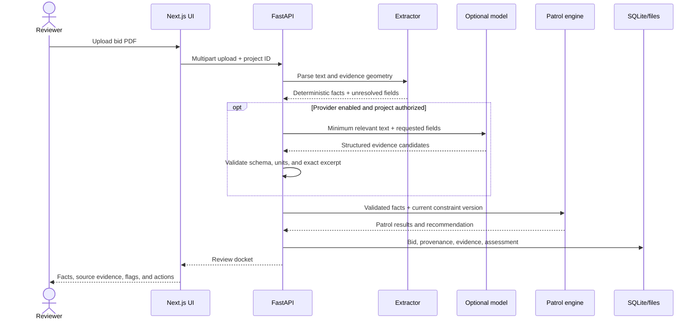

# PO-LICE Technical Guide

This document describes the current executable prototype. When it conflicts
with code or assertion-based tests, the code and tests win.

## Core safety rule

> **LLM/VLM extracts and explains; deterministic rules and math validate.**

- Model output is an evidence-bound candidate, never a compliance verdict.
- Missing or uncertain evidence becomes `FLAG`, not an inferred value.
- Patrol results are reproducible from stored facts, units, rule inputs,
  constraint version, and engine behavior.
- Reviewer approval, correction, rejection, and RFI approval are separate
  audited actions.

## Runtime architecture

| Layer | Technology | Responsibility |
| --- | --- | --- |
| Web client | Next.js 14, React, TypeScript, Tailwind CSS | Review queue, bid comparison, evidence inspection, upload, simulation, RFI approval, and activity UI |
| API | FastAPI, Pydantic | Validates requests and exposes the implemented workflow |
| Document extraction | PyMuPDF and conservative regex parsing | Text, normalized facts, page references, rectangles, page geometry, and document metadata signals |
| Optional model extraction | Ollama, then Gemini | Proposes only unresolved supported facts with exact source excerpts |
| Decision engine | Deterministic Python patrol service | Applies versioned thresholds and calculates `PASS`, `FAIL`, `FLAG`, recommendation, and TCO scenario output |
| Demo persistence | SQLite WAL plus local filesystem | Bid records, source provenance, decisions, constraints, assessments, RFI states, activity, and uploaded PDFs |
| Deployment | Vercel and Render | Public frontend and backend prototype |

PostgreSQL/pgvector migrations and a synthetic seeder exist, but the live API
does not yet use Supabase for runtime CRUD, authentication/RLS, object
storage, or vector retrieval.

## Request flow



## Frontend

The app routes live under `app/`, reusable UI under `components/`, and the
canonical HTTP client under [`lib/api.ts`](./lib/api.ts). The deployed
frontend reads `NEXT_PUBLIC_PO_LICE_API_URL`; provider secrets never belong in
the browser.

Main reviewer flows:

- review queue and summary metrics;
- bid portfolio comparison;
- bid detail, checks, evidence, and source data;
- PDF upload;
- bounded cost simulation;
- reviewer decision recording;
- RFI draft review and approval;
- activity log and CSV export.

## Backend

The FastAPI boundary is [`backend/main.py`](./backend/main.py). Pydantic
contracts are under [`backend/app/models`](./backend/app/models), with the
main services under [`backend/app/services`](./backend/app/services).

The implemented API covers:

- liveness and readiness;
- bid upload, list, detail, source PDF, and delete;
- simulation;
- reviewer decisions with optimistic version checks;
- RFI generation and approval;
- site-constraint version updates and reassessment;
- activity retrieval/export used by the dashboard.

Use the deployed [Swagger UI](https://po-lice-backend-staging.onrender.com/docs)
or [OpenAPI JSON](https://po-lice-backend-staging.onrender.com/openapi.json)
as the exact route-level contract.

## Extraction cascade

The default path requires no model:

1. PyMuPDF extracts document text and page geometry.
2. Regex and normalization produce supported facts and evidence annotations.
3. If enabled, Ollama receives only unresolved supported fields.
4. If unresolved fields remain, Gemini may run only for an authorized project.
5. Pydantic validates provider structure, units, field allow-list, and exact
   source support.
6. Conflicts or missing facts remain for human review.

No provider is called when deterministic extraction already resolved every
supported field. Ollama is a text LLM adapter in the current implementation,
not a full CAD/VLM parser. Configuration, privacy controls, and evaluation
commands are in [backend/ML_EXTRACTION.md](./backend/ML_EXTRACTION.md).

## Deterministic patrols

[`PatrolEngineService`](./backend/app/services/patrols.py) runs four checks:

| Patrol | Current purpose |
| --- | --- |
| Building Patrol | Power draw, access width, and contractual warranty limits |
| Green Patrol | Embodied-carbon cap and suspicious low-price benchmark |
| Vice Squad | Safety certificate, contract clauses, and integrity correlations |
| Traffic Control | Delivery exposure, lifecycle change, and bounded TCO scenario |

Any hard threshold breach produces `FAIL`. Missing required evidence produces
`FLAG`. The overall recommendation is `REJECT` when a patrol fails,
`REVIEW_REQUIRED` when review flags remain, otherwise `RECOMMENDED`.

Constraints are versioned in SQLite and loaded by the Python rules engine.
Changing a constraint creates a new assessment while preserving the prior
human decision.

## Persistence and audit

Demo storage is explicit:

```text
$PO_LICE_DATA_DIR/
├── po_lice.sqlite3
└── uploads/
    └── {bid_id}.pdf
```

The repository layer provides project-scoped upload idempotency, immutable
source provenance, optimistic decision versions, constraint versions,
assessment history, and separate RFI draft/approval states.

Current limitation: duplicate/integrity correlation is process-local and
resets when the backend process restarts. The prototype should not be
described as having production-grade immutable audit storage.

## Configuration

Frontend:

```bash
NEXT_PUBLIC_PO_LICE_API_URL=http://localhost:8000
```

Backend deterministic demo:

```bash
DEMO_MODE=true
PO_LICE_PROJECT_ID=PRJ-POLICE-01
PO_LICE_ALLOWED_ORIGINS=http://localhost:3000
OLLAMA_ENABLED=false
REMOTE_EXTRACTION_ENABLED=false
```

Keep Gemini/Ollama settings and all secrets server-side. Never use a
`NEXT_PUBLIC_*` variable for an API key.

## Verification

Run the smallest relevant check first, then the full release sequence:

```bash
python3 scripts/seed_demo_data.py
PYTHONDONTWRITEBYTECODE=1 PYTHONPATH=backend python3 -m pytest backend/tests
PYTHONDONTWRITEBYTECODE=1 PYTHONPATH=backend python3 scripts/test_pipeline.py
npm run build
```

Public acceptance:

```bash
python3 scripts/acceptance_gate.py \
  --backend https://po-lice-backend-staging.onrender.com \
  --frontend https://po-lice.vercel.app
```

Report backend tests, frontend build, database integration, and browser/public
acceptance separately. A static inspection is not runtime proof.

## Deployment and collaboration

- Vercel deploys the Next.js frontend.
- Render deploys the FastAPI backend.
- `main` is the integration branch.
- Each change uses a short-lived branch and pull request.
- Pull requests run cross-stack CI before merge.
- Resolve conflicts on the feature branch, rerun CI, and never force-push or
  force-merge `main`.

For the competition procedure and rollback steps, use
[DEMO_RUNBOOK.md](./DEMO_RUNBOOK.md).

## Intended next architecture

The active OpenSpec proposals describe intended production hardening:

- [Robust Supabase backend](./openspec/changes/robust-supabase-backend/)
- [Multi-provider PDF extraction](./openspec/changes/multi-provider-pdf-extraction/)
- [Configurable AI provider routing](./openspec/changes/configurable-ai-provider-routing/)
- [Competition demo readiness](./openspec/changes/competition-demo-readiness/)

These documents are plans and acceptance criteria. They are not proof that
unchecked work is implemented.
